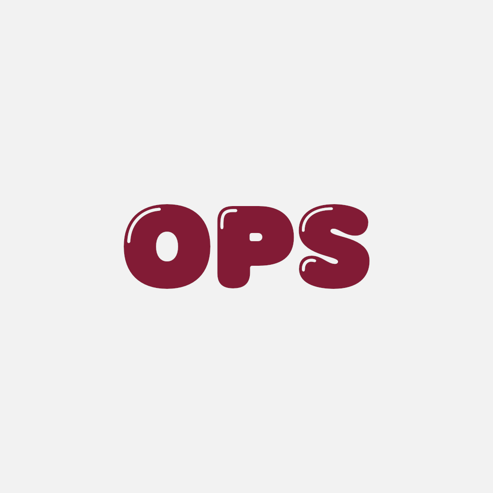

<div style="display: flex; flex-direction: column; align-items: center;">
  
  <h1>OpenSpace</h1>


</div>

---

## 📋 Prerequisites

<div style="display: flex; align-items: center; gap: 10px; margin-bottom: 5px;">
  
  <span><a href="https://docs.expo.dev/get-started/set-up-your-environment/?platform=android&device=simulated&mode=expo-go">Env Setup</a> (Win/Mac/Linux)</span>
</div>
<div style="display: flex; align-items: center; gap: 10px; margin-bottom: 5px;">
  
  <span><a href="https://docs.expo.dev/get-started/set-up-your-environment/?platform=ios&device=simulated&mode=expo-go">Env Setup</a> (Mac only)</span>
</div>
<div style="display: flex; align-items: center; gap: 10px; margin-bottom: 5px;">
  
  <span><a href="https://nodejs.org/en/download">Runtime</a></span>
</div>
<div style="display: flex; align-items: center; gap: 10px;">
  
  <span><strong>Package Manager:</strong> <code>npm i -g pnpm</code></span>
</div>

---

## 🚀 Getting Started

### 1. Installation

```bash
# Install pnpm if missing
npm i -g pnpm

# Install dependencies
pnpm i

# Run prebuild
pnpm prebuild
```

### 2. Run Application

```bash
# Start Android Emulator
pnpm android

# Start iOS Simulator
pnpm ios
```
**Controls** (Press in terminal)

- `a`: Open Android

- `i`: Open iOS

- `r`: Reload

- **Scan QR**: Run on physical device

---

## 🧪 End-to-End Testing

### Build Binaries

```bash
# Android
pnpm build:detox-android

# iOS
pnpm build:detox-ios
```

### Run Tests

```bash
# Android
pnpm test:detox-android

# iOS
pnpm test:detox-ios
```

## 📦 Build & Release

```bash
# Android Preview
pnpm build:android-preview

# iOS Preview
pnpm build:ios-preview
```
